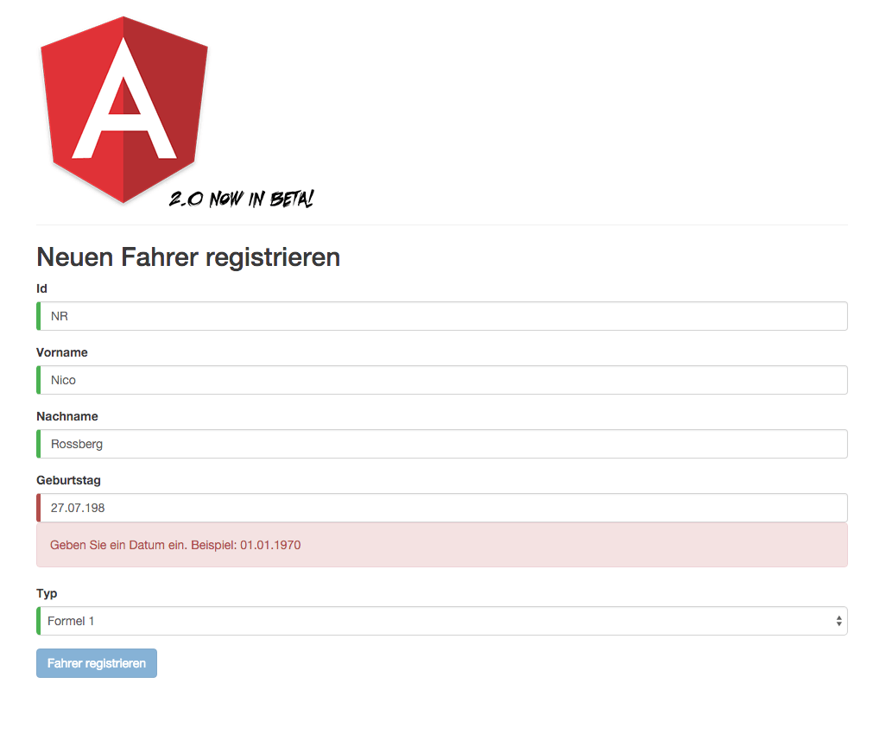
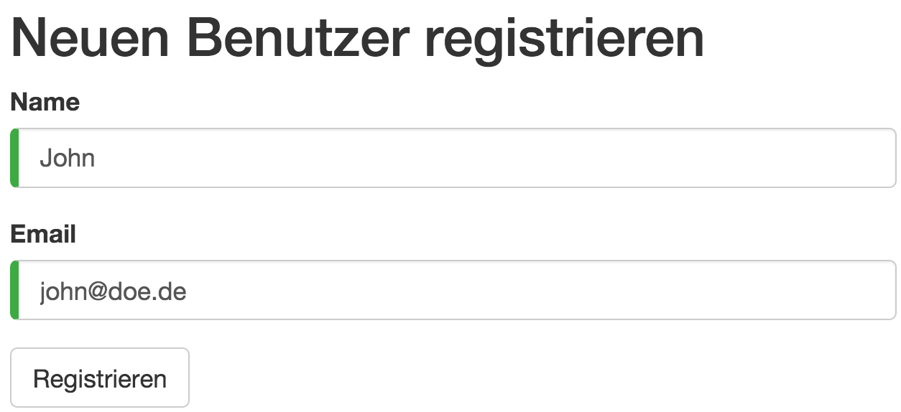
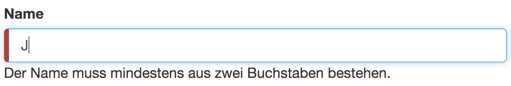

# Formularvalidierung mit Angular 2.0

## Das komfortable Handling von Formularen ist eine der wichtigsten Aufgaben moderner Web-Frameworks. Angular 2 zeigt, wie man es richtig macht.

Dies ist der vierte Artikel in unserer Reihe zu Angular 2.
In den vorherigen Artikeln haben wir bereits SystemJS, Templates, Dependency Injection, Unit-Testing und asynchrone HTTP-Kommunikation kennen gelernt.
Mit dabei ist stets das \glqq Car Dashboard", welches kontinuierlich neue Funktionen erhält.
In diesem Artikel soll nun die Verarbeitung von Formulardaten im Focus stehen.


> Screenshot: Das Cars Dashboard mit neuem Formular

Als Webentwickler haben wir regelmäßig mit HTML-Formularen zu tun. Sie dienen der Gewinnung relevanter Informationen, welche weiterverarbeitet werden sollen.
Neben der bloßen Eingabe der Daten spielt es eine wichtige Rolle, ein adäquates visuelles Feedback an den Benutzer weiter zu geben. Fehleingaben sollen frühzeitig signalisiert werden. Auf Änderung der Eingabedaten muss ein Formular schnell reagieren können.
Angular 2 hilft dabei, jene Anforderungen umzusetzen.

Wie gewohnt steht ein komplettes, lauffähiges Beispiel auf GitHub zur Verfügung, dass die hier besprochenen Inhalte demonstriert: https://github.com/Angular2Buch/angular2-forms

## Übrigens

Ende Dezember 2015 hat Angular 2 den Beta-Status erreicht.
Die hier gezeigten Codebeispiele sollten in Zukunft kaum noch tiefgreifende Änderungen aufweisen.
Dies sind die wesentlichen Änderungen:

* Der Namensraum `angular2/angular2` existiert nicht mehr. Beispielsweise befinden sich die Dekoratoren für eine Komponente nun in `angular2/core`.
* Konstanten wie `CORE_DIREVCTIVES` oder `FORM_DIRECTIVES` brauchen nicht mehr explizit referenziert werden. Die Direktiven `*ngIf`, `ngModel`, usw. ... stehen nun sofort zur Verfügung.
* Direktiven werden nun in `lowerCamelCase` und nicht mehr in `kebap-case` geschrieben (`ng-model` wird zu `ngModel`).

Die Beispiele aus den vorherigen Artikeln haben wir für Sie auf neuesten Stand gebracht:

* https://github.com/Angular2Buch/angular2-module
* https://github.com/Angular2Buch/angular2-template-syntax
* https://github.com/Angular2Buch/angular2-testing


## Controls und Control Groups

Die Basis der Formularverarbeitung sind die Klassen `Control` und `ControlGroup`.
Um sie in einer Komponente zu verwenden müssen sie aus dem Namensraum `angular2/common` importiert werden.

```javascript
import {Control, ControlGroup} from 'angular2/common';
```
> Control und ControlGroup importieren


## Control

Ein `Control` wertet den Wert eines Eingabelements aus. Es erweitert das Eingabeelement um Informationen, ob dessen Wert gültig oder ungültig ist oder es bereits bearbeitet wurde. 
Ein Control übernimmt drei optionale Parameter. Einen Wert, sowie einen Validator und asynchronen Validator.

```javascript
this.nameControl = new Control('Initialer Wert',
/* synchroner Validator -> */ Validators.required,
/* asynchroner Validator -> */ IdValidator.uniqueId);
    
nameControl.value; // -> 'Initialer Wert'
nameControl.errors; // -> undefined
```
> Control initialisieren


Das Control kann im HTML-Template der Komponente über die Direktive `ngControl` gebunden werden.

```javascript
<input type="text" ngControl="nameControl" required>
```
> Control im Template verwenden

Je nach Zustand des Controls fügt ngControl automatisch CSS-Klassen an das jeweilige Eingabeelement hinzu.

```html
<input type="text"
  class="ng-pristine ng-valid ng-touched"
  ngcontrol="nameControl"
  required>
```
> Repräsentation des Eingabeelements im Browser

Da der Status des Controls durch CSS-Klassen repräsentiert wird, kann das Element entsprechend gestaltet werden.

```css
.ng-valid {
  border-left: 5px solid #42A948; /* -> gr¨un */
}

.ng-invalid {
  border-left: 5px solid #a94442; /* -> rot */
}
```
> CSS-Klassen des Controls für visuelles Feedback einsetzen

So erhält der Benutzer, zu seiner getätigten Eingabe, direktes, visuelles Feedback.

### Achtung
> Die Voraussetzung für das Funktionieren eines `Controls` ist, dass es innerhalb eines Formulars verwendet wird.
> Grund hierfür ist, dass Angular an jedes `<form>`-Tag eine Instanz der Klasse `NgForm` anfügt, um Daten im Formular automatisch aktualisieren zu können.
> Das kann zu Beginn verwirren, weil dieser Vorgang hinter den Kulissen geschieht.

* __dirty__: Der Wert wurde bearbeitet
* __pristine__ :Der Wert ist unberührt
* __valid__: Der Wert ist gültig
* __touched__: Das Control wurde verwendet/bedient
* __untouched__: Das Control wurde noch nicht verwendet
* __pending__: Eine asynchrone Eingabevalidierung läuft
> Zustände eines Controls


## ControlGroup

In der Regel bestehen Formulare aus einer Vielzahl von Eingabefeldern. `ControlGroup` erlaubt es, beliebig viele Controls als Schlüssel-Wert-Paar zusammenzufassen.

```javascript
class RegisterUserComponent {
  userForm: ControlGroup;

  nameControl: Control;
  emailControl: Control;

  constructor() {
    this.nameControl  = new Control('John',        Validators.required);
    this.emailControl = new Control('john@doe.de', Validators.required);

    this.userForm = new ControlGroup({
      name  : this.nameControl,
      email : this.emailControl
    });
  }
}
```
> Controls einer ControlGroup hinzufügen

Auch die Controlgroup verfügt über Eigenschaften die bereits aus der Klasse Control bekannt sind.

```javascript
this.userForm.value; // -> {"name":"John","email":"john@doe.de"}
this.userForm.valid; // -> true
```
> ControlGroup auswerten


Im vorherigen Listing ist zu sehen, wie Validatoren direkt in einem Control verwendet werden (`Validators.required`).
Die ControlGroup kann mit der Direktive `ngFormModel` an das Template gebunden werden.

```html
<form [ngFormModel]="userForm">
  <input type="text"
         ngControl="name">
  <input type="text"
          ngControl="email">
  <button type="submit"
          [disabled]="!userForm.valid">
    Registrieren
  </button>
</form>
```
> ControlGroup im Template verwenden

Da aus `userForm` die Gültigkeit der Eingaben bekannt ist, kann mit Hilfe der Eigenschaft `valid` gesteuert werden, ob der Benutzer das Formular absenden kann.


> Screenshot: Eingabeformular - Beispiel Registrierung


## Vorhandene Validatoren

Derzeit verfügt das Angular Framework über drei Validatoren, die sofort  eingesetzt werden können.
Diese können ebenfalls aus dem Modul `angular2/common` abgerufen werden.

```javascript
import {Validators} from 'angular2/common';
```
> Validatoren importieren

* required
* minlength
* maxlength

So kann für ein beliebiges Control beispielsweise eine Mindestlänge verlangt werden.

```javascript
this.nameControl = new Control('',
Validators.minlength(2))
```
> MinLength Validator

Im Formular kann ein Verstoß gegen diese Regel explizit ausgegeben werden.

```
<form [ngFormModel]="userForm">
  <input #name="ngForm"
         ngControl="name"
         type="text">

  <div *ngIf="!name.valid && name.errors.minlength">
    Der Name muss mindestens aus zwei Buchstaben bestehen.
  </div>

  <!-- ... -->
</form>
```
> MinLength verwenden


> Screenshot: Validierung - Eingabefeld mit definierter, minimaler Länge

Im Beispiel wird eine lokale Referenz auf das Control angelegt. Sie ist als `#name` bezeichnet. Dadurch wird es möglich den aktuellen Zustand des Controls in anderen Elementen zu verwenden. Mit `*ngIf` wird geprüft ob ein Fehler für die Validierungsregel `minlength` vorliegt. Trifft das zu, wird die Fehlermeldung unter dem Eingabefeld eingeblendet.

### Achtung
> Es ist erforderlich, dass bei der Prüfung auf das Fehlerobjekt `errors` vorher sichergestellt werden muss, dass das betreffende Control invalid ist.
> Ist das Control im validen Zustand ist das Fehlerobjekt `undefined`. Ein Zugriff auf einen der Schlüssel verursacht dann einen Fehler.

Zugegeben, nur drei vorhandene Validatoren sind wirklich nicht viel.
Weitere eingebaute Überprüfungen werden folgen, mehrere Issues sind hierzu auf Github offen (z.B. #2961, #2962 und #5411).
Wahrscheinlich können wir mit `email`, `url`, `number`, `date`, `time`, `week`, `month`, `min`, `max` und `pattern` (regex) rechnen. 

## Validatoren kombinieren

Es ist auch möglich mehrere Validierungsregeln an ein Control zu binden. Dazu wird die Wrapper-Methode `Validators.compose` verwendet, der eine Liste beliebig vieler Validatoren übergeben werden kann.

```javascript
this.nameControl = new Control('', Validators.compose([
  Validators.required,
  Validators.minLength(2)]))
```
> Validatoren kombinieren


## Eigene Validatoren schreiben

Eigene Regeln und Eingabeformate gibt es reichlich (Beispielsweise: KFZ-Kennzeichen, ISBN, Postleitzahl, ...). Für spezielle Anwendungsfälle können eigene Validatoren implementiert werden.
Dabei handelt es sich um Klassen die statische Methoden für die Validierung bereitstellen. Damit das Ergebnis der Überprüfung im Template ausgewertet werden kann, ist es erforderlich, dass ein Schlüssel-Wert-Paar vom Typ `<string, boolean>` zurückgegeben werden.
Um die Typsicherheit zu gewährleisten, kann für diesen Zweck ein Interface definiert werden.

```javascript
interface ValidationResult{
  [key:string]:boolean;
}
```
> Interface für ValidationResult

Als Beispiel wird ein Validator implementiert, der prüft ob ein deutsches Datumsformat vorliegt. Der Methode `germanDate` wird ein Control übergeben, dessen Wert mit einem regulären Ausdruck überprüft wird. Liegt kein Datum im korrekten Format vor, wird für das Fehlerobjekt des Controls der Eintrag `"germanDate": true` erzeugt.
Wird kein Fehler gefunden wird `null` zurückgegeben.

```javascript
import {Control} from 'angular2/common';

export class DateValidator {
  static germanDate(control: Control): ValidationResult {
    let germanDatePattern = /^\d{1,2}\.\d{1,2}\.\d{4}$/;

    if (!control.value.match(germanDatePattern))
      return { "germanDate": true };

    return null;
  }
}
```
> Implementierung eines Validators

Der eigene Validator kann nun in der Komponente verwendet werden.

```javascript
/* ... */
import {DateValidator} from 'date.validator.ts';

class RegisterUserComponent {
  /* ... */

  bithdateControl: Control;

  constructor() {
    /* ... */
    this.bithdateControl: new Control('', DateValidator.germanDate);;

    this.userForm = new ControlGroup({
      /* ... */
      birthDate: this.birthdateControl
    });
  }
}
```
> Validator in einer Komponente verwenden


Im Template der Komponente kann ebenfalls eine Fehlernachricht ausgegeben werden. Hierbei ist es wichtig, dass der exakte Schlüsselname des Validators verwendet wird.

```html
<div *ngIf="!birthdate.valid && birthdate.errors.germanDate">
    Geben Sie ein Datum ein.
    Beispiel: 01.01.1970
</div>
```
> Validierungsergebnisse im Template ausgeben


## Asynchrone Validatoren

Um die Validität von Eingaben zu prüfen, ist es manchmal erforderlich einen externen Dienst anzufragen.
Bei der Vergabe von neuen E-Mail-Adressen oder eindeutigen Benutzernamen ist dieser Vorgang unabdinglich.
Für solche Szenarien eignen sich asynchrone Validatoren. Sie zeichnen sich dadurch aus, dass sie eine `Promise` zurückgeben, in dem das Ergebnis der Überprüfung enthalten ist.

Das folgende Beispiel skizziert den Zeitversatz durch die asynchrone Prüfung anhand der Methode `setTimeout`.
Es wird geprüft, ob eine Id eindeutig ist oder nicht.
Ist dies nicht der Fall, so wird erneut ein Eintrag für das Fehlerobjekt des Controls erstellt (`"uniqueId": true`).

```javascript
import {Control} from 'angular2/common';

export class DateValidator {
  static germanDate(control: Control): ValidationResult {
    let germanDatePattern = /^\d{1,2}\.\d{1,2}\.\d{4}$/;

    if (!control.value.match(germanDatePattern))
      return { "germanDate": true };

    return null;
  }
}
```
> Implementierung eines asynchronen Validators

Bei der Verwendung asynchroner Validatoren ist lediglich zu Beachten, dass sie als dritter Parameter im Konstruktor des Ziel-Controls referenziert werden.

```javascript
/* ... */
import {IdValidator} from 'id.validator.ts';

class RegisterUserComponent {
  /* ... */
  id: Control;

  constructor() {
    /* ... */
    this.id: new Control('', Validators.required,
                             IdValidator.uniqueId);;

    this.userForm = new ControlGroup({
      /* ... */
      id: this.id
    });
  }
}
```
> Asynchronen Validator in Komponente verwenden

Für die Bindung im Template bieten asynchrone Validatoren eine komfortable Hilfe. Solange die Validierung läuft wird im Control die Eigenschaft `pending` auf `true` gesetzt.
Das ermöglicht visuelles Feedback für den Benutzer des Formulars und signalisert, dass die Verarbeitung im Gang ist.
Beispielsweise ist ein rotierender Indikator so mittels CSS3 schnell implementiert.
Das ungekürzte Beispiel mit der kompletten Verarbeitungslogik finden Sie auf GitHub.

```javascript
<div *ngIf="id.pending">
  Überprüfe Verfügbarkeit...
</div>

<div *ngIf="!id.valid && !id.pending && id.errors.uniqueId">
  Diese Id exisitert bereist.
</div>
```
> Validierungserbenisse im Template ausgeben

## Fazit und Ausblick

Angular 2 ermöglicht es einen Großteil des Verhaltens eines Formulars in der Komponente zu definieren.
Templates enthalten somit wenig Validierungslogik als noch in Angular 1.
Das bereinigt das Template und ermöglicht es, die Validierung mehr in Richtung der Domänenlogik anzusiedeln.
Dies ist ein gute Entscheidung.
Eigene Validierungslogik kann schnell selbst entwickelt und in die Anwendung integriert werden.
Sobald das Konzept der Controls, ControlGroups und Validatoren verstanden ist, ergibt sich ein geradliniger Entwicklungsprozess zum Erstellen und Erweitern von Webformularen. Wir wünschen viel Spaß beim Ausprobieren.

Nun hat unsere Anwendung mitlerweile viele Funktionen bekommen.
Es wird eng auf dem zur Verfügung stehenden Bildschirm. In der nächsten Ausgabe der __Web und Mobile Developer__ wird es um den Router von Angular 2 gehen. Wir werden Ihnen zeigen, wie Sie zwischen einzelnen Komponenten navigieren können und dabei anschauliche und für Suchmaschinen optimiere URLs erhalten. Seien Sie gespannt.

<hr>

## Über die Autoren


**Johannes Hoppe** ist selbstständiger IT-Berater und Softwareentwickler. Er arbeitet derzeit als Architekt für ein Portal auf Basis von .NET und AngularJS. Er veranstaltet Trainings zu AngularJS und bloggt unter http://blog.johanneshoppe.de/ .


**Gregor Woiwode** ist als AngularJS und Mac-Entwickler für ein junges Unternehmen in Karlsruhe tätig. Er veranstaltet Trainings zu AngularJS und bloggt unter http://www.woiwode.info/blog/ .


## Quellen
* https://github.com/Angular2Buch/angular2-forms - Vollständiges Beispiel
* https://github.com/angular/angular/ - Offizielles Angular 2.0 Repository
* https://github.com/angular/angular-cli - Das neue Kommandozeilentool für Angular
* https://medium.com/@daviddentoom/angular-2-form-validation-9b26f73fcb81 - Weiterführende Informationen
* https://angular.io/docs/ts/latest/guide/forms.html - Dokumentation von Angular zur Formularverarbeitung