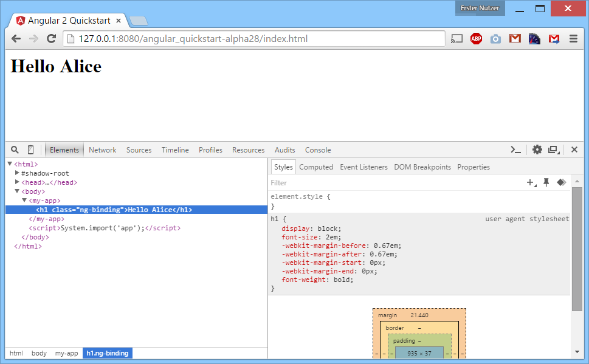
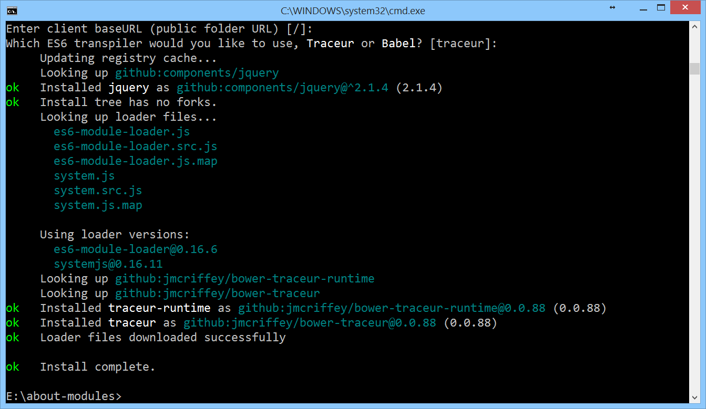

# Angular2 und modularer Code


### Inhalt
1. [Einleitung](#einleitung)
2. [Hello World](#hello)
3. [ES6 Module Loader Polyfill](#es6module)
4. [Traceur & Traceur runtime](#traceur)
5. [SystemJS](#systemjs)
6. [jspm](#jspm)
7. [Angular2 mit Gulp bauen](#angular2bauen)
8. [Angular2 mit jspm laden](#angular2jspm)
9. [Fazit](#fazit)

<hr>

<a name="einleitung"></a>
## 1. Einleitung

Angular2 wird in naher Zukunft fertig gestellt sein. Es gibt es bereits regelmäßige Vorabversionen für interessierte Entwickler. Das Angular-Team hat sich entschieden, alte Zöpfe rigoros abzuschneiden und ein komplett überarbeitetes Framework zu entwickeln. Die neue Version bricht mit bestehenden Konzepten - was für viel Aufregung gesorgt hat. Die Template-Syntax ist neu und man setzt nun Komponenten statt Controller ein. Auch der Einsatz von TypeScript rüttelt am einher gebrachten. In diesem Artikel soll auf eine weitere maßgebliche Änderungen eingegangen werden. Diese betrifft das Laden von JavaScript-Dateien. Weitere Artikel zu den Neuerungen in Angular2 folgen in den kommenden Ausgaben der Web und Mobile.

<a name="hello"></a>
## 2. Hello World

Auf der neuen Website unter **angular.io** findet man einen kurzen [5 Minuten Schnellstart][1] in das neue Framework. In dem Quickstart wird unter anderem beschrieben, wie man eine erste Komponente erstellt. Ebenso wird der Transpiler TypeScript vorgestellt, welcher die Datei `app.ts` in eine JavaScript-Datei Namens `app.js` umwandelt.

```javascript
<html>
  <head>
    <title>Angular 2 Quickstart</title>
    <!-- Zeile 1 --> <script src="https://github.jspm.io/jmcriffey/bower-traceur-runtime@0.0.87/traceur-runtime.js"></script>
    <!-- Zeile 2 --> <script src="https://jspm.io/system@0.16.js"></script>
    <!-- Zeile 3 --> <script src="https://code.angularjs.org/2.0.0-alpha.28/angular2.dev.js"></script>
  </head>
  <body>
    <my-app></my-app>
    <!-- Zeile 4 --> <script>System.import('app');</script>
  </body
```
> [index.html](angular_quickstart-alpha28/index.html)

```javascript
import {Component, View, bootstrap} from 'angular2/angular2';

@Component({
  selector: 'my-app'
})
@View({
  template: '<h1>Hello {{ name }}</h1>'
})
class MyAppComponent {
  name: string;
  constructor() {
    this.name = 'Alice';
  }
}

bootstrap(MyAppComponent);
```
> [app.ts](angular_quickstart-alpha28/app.ts)

 Das Beispiel baut auf einer Reihe von Frameworks auf, um diese Datei zu laden und auszuführen. Die eigentliche Funktion dieses Beispiels erschließt sich aber dennoch schnell. Das DOM-Element `<my-app>` wird mit einer eine Überschrift ergänzt, welche den Text "Hello Alice" trägt.


> Screenshot: Der Output im Browser

Hinter diesen vier markierten Zeilen verbirgt sich ein Strauß an Technologien - unter anderem Traceur, jspm, SystemJS, TypeSript und natürlich Angular2. Durch die Auswahl dieser Frameworks ist es möglich, bereits mit heutigen Browsern eine Anwendung auf Grundlage von ES6 zu entwickeln. Die verwendeten Tools sollen nun betrachtet werden. Alle gezeigten Kommandozeilen-Befehle setzen voraus, dass Node.js mit NPM installiert ist.


<a name="es6module"></a>
## 3. ES6 Module Loader Polyfill

In der Webwelt steht der Begriff "Poylfill" für ein Software, welche fehlende JavaScript-Funktionalitäten im Browser zur Verfügung stellt. In der Vergangenheit ging es bei Polyfills häufig darum, standardisierte Funkionen in alten Internet-Explorer Versionen nachzurüsten. Es können aber auch mithilfe von Polyfills Funktionen hinzugefügt werden, die gerade erst definiert wurden und daher noch von keinem Browser vollständig unterstützt werden.

Der "[ES6 Module Loader Polyfill][2]" ist ein bekanntes Tool für die Entwicklung von ECMAScript 6 Anwendungen.  
Unter anderem liefert er:
* einen asynchronen Modul-Loader für ES6-Module entsprechend der ES6-Spezifikation (`System.import`).
* die Möglichkeit, einen so genannten Transpiler wie [Traceur][3], [Babel][4] oder [TypeScript][5] direkt im Browser zu verwenden.
* das spezielle Script Tag `<script type="module">` in dem man ES6 Code-schreiben kann.

Folgendes ES6 Modul:

```javascript
export class Test {
  constructor() {
    document.body.innerText = 'This is a Constructor!';
  }
}
```
> [es6_module.js](es6_module.js)

...kann mithilfe des ES6 Module Loader Polyfill geladen und sofort ausgeführt werden:

```javascript
<script src="https://github.jspm.io/jmcriffey/bower-traceur@0.0.88/traceur.js"></script>
<script src="https://jspm.io/es6-module-loader@0.16.6.js"></script>

<script>
  System.import('es6_module').then(function(module) {
    var test = new module.Test();
  });
</script>
```
> [example_es6.html](example_es6.html)

Für die Verwendung von ES6 Features (wie z.B. einer Klasse) benötigt man einen Transpiler, welcher ECMAScript 6 in ECMAScript 5 umwandelt, damit der Code in jedem Browser ausführbar ist. Der Polyfill verwendet standardmäßig den Transpiler Traceur, welcher von Google entwickelt wird. Die Umwandlung des Quellcodes geschieht direkt im Browser, sogar eine "SourceMap" steht für ein komfortables Debugging zur Verfügung. Das Script `traceur.js` wird automatisch vom Polyfill nachgeladen, sofern es nicht bereits vorhanden ist. Aufgrund der verwendeten Ordnerstruktur würde es im vorliegenden Fall zu einem Fehler 404 (Not Found) kommen. Mit dem ersten Script-Tag wird dem Fehler 404 entgegen gewirkt, indem die benötigte Datei vorab eingebunden wird und das Nachladen nicht mehr notwendig ist.

Möchte man die ES6 Syntax nicht nur in geladenen Dateien, sondern auch in Script-Tags verwenden, so ist dies mit heutigen Browsern nicht direkt möglich. Der Browser würde den Code sofort ausführen und die unbekannten Schlüsselwörter mit einer Exception bemängeln. Mithilfe des Script-Tags `<script type="module">` kann man hingegen die ES6 Features sicher verwenden, da der Browser den Inhalt aufgrund des unbekannten Typs ignoriert. Das Transpiling geschieht dann erneut zur Laufzeit.

```javascript
<script src="https://github.jspm.io/jmcriffey/bower-traceur@0.0.88/traceur.js"></script>
<script src="https://jspm.io/es6-module-loader@0.16.6.js"></script>

<script type="module">
  import {Test} from 'es6_module';
  var test = new Test();
</script>
```
> [example_es6_import.html](example_es6_import.html)


<a name="traceur"></a>
## 4. Traceur & Traceur runtime

Das Transpiling von ES6 zur Laufzeit ist im produktiven Einsatz nicht sehr effizient. Es bietet sich an, den Code zwar in ES6 zu entwickeln, aber die Umwandlung stets vorab durchzuführen. Zu Traceur gehört ein Kommandozeilen-Script, welches das Transpiling durchführt. Folgende Befehle erzeugen eine Datei mit dem Namen `es5_module.js`:

```
npm install -g traceur
traceur --sourcemap --out es5_module.js es6_module.js
```

Um die generierte Datei verwenden zu können, muss eine passende Datei Namens `traceur-runtime.js`. eingefügt werden. Der Sinn dieser **Traceur-Runtime** besteht vorwiegend darin, mehrfach benötigten Code in den einzelnen transpilierten Dateien zu vermeiden, was später Traffic spart. In dieser Datei befinden sich der Code für das häufig verwendete globale Object `$traceurRuntime` sowie eine Reihe von Polyfills. Ohne die Runtime ist der generierten ES5-Code nicht lauffähig.

```javascript
<script src="/jspm_packages/github/jmcriffey/bower-traceur-runtime@0.0.88/traceur-runtime.js"></script>
<script src="es5_module.js"></script>

<script>
  var Test = System.get("es6_module.js").Test;
  var test = new Test();
</script>
```
> [example_traceur-runtime.html](example_traceur-runtime.html)

Damit wäre ***Zeile 1*** aus dem 5-Minuten Quickstart geklärt. Die hier verwendete Version von Angular2 wurde mit Traceur erstellt und benötigt schlicht die **Traceur-Runtime** um fehlerfrei zu funktionieren (Fehler: "[$traceurRuntime is undefined](https://github.com/angular/angular.io/issues/102)"). 


<a name="systemjs"></a>
## 5. SystemJS

In ***Zeile 2 und 4*** sieht man die Verwendung von [SystemJS](https://github.com/systemjs/systemjs).

SystemJS ist ein "universaler Module-Loader" und integriert diverse existierende Modul-Formate (ES6, AMD, CommonJS und globale Objekte). Durch die Integration von **CommonJS** können Module verwendet werden, welche ursprünglich für [Browserify](http://browserify.org/) gedacht waren. Ebenso lassen sich **AMD**-Module verwenden, welche üblicherweise über [require.js](http://requirejs.org/) geladen werden. Zusätzlich werden auch direkt ES6-Module mittels des bereits vorgestellten **ES6 Module** Loader Polyfills unterstützt.

Das bekannte Framework jQuery (als AMD-Modul verwendbar) lässt sich z.B. wie folgt einbinden:

```js
<script src='/jspm_packages/system.js'></script>
<script src='/config.js'></script>

<script>
  System.import('jquery').then(function($) {
    $("body").text('Hello World!');
  });
</script>
```
> [example_systemjs_jquery.html](example_systemjs_jquery.html)


SystemJS lädt in dieser Version immer auch den bereits vorgestellten "ES6 Module Loader Polyfill" (`es6-module-loader.js`) nach, so dass dessen gesamte Funktionalitäten stets zur Verfügung stehen.


<a name="jspm"></a>
## 6. jspm

jspm ist ein Paketmanager, welcher **indirekt** in Zeile 2 verwendet wird. Die Verwendung von jspm erleichtert die Einbindung von Paketen enorm. Jene Pakete können aus der [npm](npmjs.com)-registry oder direkt aus Github Repositorien stammen. Im Falle eines Github-Repositoriums werden fertige Versionen mittels Git-Tags markiert. Dies entspricht dem Vorgehen von [bower](http://bower.io). Hervorzuheben ist die Verwendung einer flachen Ordnerstruktur, was ebenso dem Ansatz von Bower entspricht. Jspm ist für die Verwendung mittels [SystemJS](https://github.com/systemjs/systemjs) ausgelegt.

Mit folgendem Befehlen lässt sich beispielsweise die aktuellste Version jQuery von dessen Github-Repository herunter zu laden:

```
npm install -g jspm@0.15.7
jspm install jquery
```

Wird `jspm install` auf ein leeres Verzeichnis angewendet, so erscheint der Assistent welcher auch durch `jspm init` gestartet werden kann. Obwohl man jquery angefordert hat, wird zusätzlich SystemJS sowie dessen Abhängigkeiten herunter geladen.  Es wird durch `jspm init` eine Datei namens package.json angelegt. Unter dem Prefix "jspm" können alle gewünschten Abhängigkeiten eingetragen werden. Wie bei npm lassen sich per `jspm install` bzw. `jspm update` später erneut alle Dateien herunter laden. Weiterhin wird eine Datei names `config.js` angelegt, über die unter anderem die zu verwendenden Pfade konfiguriert werden.


> Screenshot: jspm führt durch die Installation

Alle bisherigen Beispiele verwendeten das CDN (Content Delivery Network) von jspm.io. Ein produktiver Einsatz des CDN ist jedoch noch nicht empfehlenswert, da das CDN als experimentell gilt! Während der Arbeit an diesem Artikel fiel das CDN mehrfach aus. Verwenden Sie statt dessen das jspm Kommandozeilen-Tool, um alle Abhängigkeiten herunter zu laden und die Dateien selbst zu hosten.


<a name="angular2bauen"></a>
## 7. Angular2 mit Gulp bauen

In ***Zeile 3*** sieht man ein vorbereitetes Bundle mit dem Namen `angular2.dev.js`. Es bietet sich an, diese Datei auch selbst zu erzeugen. Dies ist vergleichsweise einfach, das die diversen Schritte mittels des Automatisierungstools [Gulp][6] vereinfacht wurden. Nachdem Angular2 vom [Github-Repository][7] herunter geladen wurde, muss Gulp zunächst installiert und dann ausgeführt werden.  

```
npm install
npm install -g gulp
gulp build
```

Es werden eine Reihe von Dateien im Ordner 'dist' erzeugt. Das die Datei `angular2.dev.js` befindet sich im Ordner `dist/js/bundle`. Den Inhalt dieses Ordners veröffentlicht das Angular-Team bei jeder neuen Alpha-Version auf [code.angularjs.org][8]. Ganz konkret handelt es sich bei `angular2.dev.js` um ein ES5-kompatibles Bundle, welches mit dem [SystemJS Build Tool][9] erstellt wurde. SystemJS verwendet wiederum Traceur, was die die Notwendigkeit für die Runtime erklärt. Bei der Datei `angular2.sfx.dev.js` handelt es sich um ein ES5-kompatibles Bundle, welches ein [Self-Executing bundle][10] ist. In dieser Datei ist die Traceur Runtime bereits enthalten. Ebenso wird Angular wird über das globale Objekt `window.ng` verfügbar gemacht. Damit spricht man ES5-Entwickler an, die weder SystemJS noch den ES6 Module Loader Polyfill verwenden wollen. Im folgenden ein Beispiel für die Verwendung:

```html
<html>
  <head>
    <title>Angular 2 Quickstart (ES5)</title>
    <script src="https://code.angularjs.org/2.0.0-alpha.37/angular2.sfx.dev.js"></script>
    <script>

    var app = ng
      .Component({
        selector: 'my-app'
      })
      .View({
        template: '<h1>Hello {{ name }}</h1>'
      })
      .Class({
        constructor: function () {
          this.name = "Alice";
        }
      });

      document.addEventListener('DOMContentLoaded', function() {
        ng.bootstrap(app);
      });
    </script>
  </head>
  <body>
    <my-app></my-app>
  </body>
</html>
```
> [example_es5.html](example_es5.html)

Die anderen Fragmente aus dem Build findet man im [NPM-Paket von Angular2](https://www.npmjs.com/package/angular2) wieder:


| Build-Verzeichnis                  | Verzeichnis im [NPM-Paket](https://www.npmjs.com/package/angular2) | JavaScript-Version | Modul-Format                       | Erklärung                                                                                                  |
|------------------------------------|--------------------------------------------------------------------|--------------------|------------------------------------|------------------------------------------------------------------------------------------------------------|
| dist/js/bundle/angular2.sfx.dev.js | (kein)                                                             | ECMAScript&nbsp;5  | Globales Objekt (`window.ng = ng`) | Transpiliertes Bundle mit globalem Objekt, Verfügbar auf [code.angularjs.org](https://code.angularjs.org/)
| dist/js/bundle/angular2.dev.js     | (kein)                                                             | ECMAScript&nbsp;5  | SystemJS (`System.register()`)     | Transpiliertes Bundle für SystemJS, Verfügbar auf [code.angularjs.org](https://code.angularjs.org/)
| dist/js/cjs/angular2               | ./ (root folder)                                                   | ECMAScript&nbsp;5  | CommonJS (`exports.XXX = XXX`)     | Einzelne Dateien, verwendbar mit Browserify, sowie TypeScript type definitions (*.d.ts)<br><br>Wird im nächsten Abschnitt ([7. Angular2 mit jspm laden](#angular2jspm)) verwendet.
| dist/js/dev/es6/angular2           | es6/dev                                                            | ECMAScript&nbsp;6  | ES6 (`export * from XXX`)          | Einzelne Dateien mit Prüfungen zur Laufzeit ([run-time type assertion library](https://www.npmjs.com/package/rtts-assert)), sowie TypeScript type definitions (*.d.ts)
| dist/js/prod/es6/angular2          | es6/prod                                                           | ECMAScript&nbsp;6  | ES6 (`export * from XXX`)          | Einzelne Dateien ohne Prüfungen zur Laufzeit, sowie TypeScript type definitions (*.d.ts)


-------

<a name="angular2jspm"></a>
## 8. Angular2 mit jspm laden

Mit jspm und SystemJs gibt es einen sehr komfortablen Weg, stets mit der neuesten Version von Angular zu arbeiten. Durch jspm kann man regelmäßig die aktuelle Version von Angular2 und seinen Abhängigkeiten beziehen. SystemJS wiederum lädt alle Dateien asynchron im Browser und transpiliert den eigenen TypeScript-Code. In diesem Szenario muss TypeScript nicht mehr über die Kommandozeile verwendet werden.  

Zunächst muss man die neueste Beta-Version von jspm verwenden (aktuell [0.16.0-beta.3](https://github.com/jspm/jspm-cli/releases/tag/0.16.0-beta.3)). So erhält man die komplett erneuerte Version von SystemJS (aktuell [SystemJS 0.18.x](https://github.com/systemjs/systemjs/releases)). Ab SystemJS 0.1.7 gibt es wichtige [Änderungen](https://github.com/systemjs/systemjs/releases/tag/0.17.0), durch die das folgende Beispiel funktioniert. Die größte Änderungen bestehen darin, dass der ES6 Module Loader Polyfill (`es6-module-loader.js`) nicht mehr verwendet wird und direkter Support für TypeScript hinzugekommen ist.

```
npm install -g jspm@beta
jspm install typescript
jspm install angular2
jspm install reflect-metadata zone.js es6-shim
```

Die neu erstelle Datei `config.js` muss angepasst werden, damit TypeScript als Transpiler verwendet wird:

```javascript
System.config({
  "baseURL": "/",
  "defaultJSExtensions": true,
  "transpiler": "typescript",
  "typescriptOptions": {
    "module": "commonjs",
    "emitDecoratorMetadata": true
  },
  "paths": {
    /* [...] */
  }
});

System.config({
  "map": {
    /* [...] */
  }
});
```
> [config.js](../..config.js)

Die TypeScript-Datei aus dem  [5 Min Quickstart](https://angular.io/docs/js/latest/quickstart.html) kann unverändert wiederverwendet werden:

```javascript
import { Component, View, bootstrap } from 'angular2/angular2';

@Component({
  selector: 'my-app'
})
@View({
  template: '<h1>Hello {{name}}</h1>'
})
class MyAppComponent {
  name: string;
  constructor() {
    this.name = 'Alice';
  }
}

bootstrap(MyAppComponent);
```
> [app.ts](angular_jspm/app.ts)

Wenn man dann noch die Abhängigkeiten auf
* reflect-metadata,
* zone.js und
* es6-shim (Polyfill für [Array.fill](https://developer.mozilla.org/de/docs/Web/JavaScript/Reference/Global_Objects/Array/fill) bereithält)

manuell angibt, funtioniert das Beispiel wie folgt:

```html
<!DOCTYPE html>
<html>
  <head>
    <title>Angular 2 Quickstart (jspm / SystemJS / TypeScript)</title>

    <script src='/jspm_packages/system.js'></script>
    <script src="/config.js"></script>
    <script>

      System.config({
        paths: {
          app: 'text/angular-module/angular_jspm/app' // change this!
        },
        "packages": {
          "app": {
            "defaultExtension": "ts"
          }
        }
      });
    </script>
  </head>
  <body>

    <my-app></my-app>
    <script>
      System.import('zone.js');
      System.import('reflect-metadata');
      System.import('es6-shim');

      System.import('app');
    </script>

  </body>
</html>

```
[index.html](angular_jspm\index.html)

Die Anleitung zu dem Laden per JSPM basiert zum Teil auf folgendem Gist:
[Angular2 + JSPM cheat sheet](https://gist.github.com/robwormald/429e01c6d802767441ec)


<a name="fazit"></a>
## 9. Fazit

Verglichen mit der Version 1 hat sich bei AngularJS hinsichtlich der Modularität vieles zum Positiven entwickelt. AngularJS verwendete lediglich ein globales Objekt, so dass man die Qual der Wahl zwischen den Modulformaten AMD und CommonJS hatte. Die Lösung bestand dann darin, AngularJS mittels "Shims" in das gewählte Format zu pressen. Nun legt sich Angular fest, indem es auf ECMAScript 6 Module setzt. Diese wiederrum lassen sich auch als CommonJS Module abbilden, so dass auch ECMAScript 5 Entwickler keine Einschnitte hinnehmen müssen. Das Highlight ist ganz klar die Kompatibilität und der Einsatz des universalen Modul-Loaders SystemJS. Egal in welchem Format weitere Abhängigkeiten vorliegen, sie werden sich ohne großen Aufwand in eine Angular2 Anwendung integrieren lassen.

<hr>

[1]: https://angular.io/docs/js/latest/quickstart.html "5 Minuten Schnellstart"
[2]: https://github.com/ModuleLoader/es6-module-loader "ES6 Module Loader Polyfill"
[3]: https://github.com/google/traceur-compiler "Traceur"
[4]: http://babeljs.io/ "Babel"
[5]: https://github.com/Microsoft/TypeScript/ "TypeScript"
[6]: https://github.com/gulpjs/gulp "Gulp"
[7]: https://github.com/angular/angular "Angular2 Github-Repository"
[8]: https://code.angularjs.org/ "code.angularjs.org"
[9]: https://www.npmjs.com/package/systemjs-builder "SystemJS Build Tool"
[10]: https://github.com/systemjs/builder#self-executing-sfx-bundles "Self-Executing bundle"