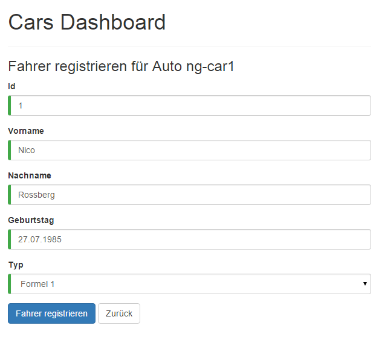

# Routing mit Angular 2.0

## Eine Single-Page Anwendung ist erst dann richtig vollständig, wenn man zwischen den Zuständen hin- und her navigieren kann. Der Nutzer profitiert dabei von Seitenwechseln ohne merkbaren Ladevorgang. Das Routing wurde in Angular 2 intensiv ausgebaut und deckt nun auch fortgeschrittene Anwendungsfälle ab.

Dies ist der fünfte und letzte Artikel aus unserer Reihe zu Angular 2.
In den vorherigen Artikeln haben wir bereits SystemJS, Templates, Dependency Injection, Unit-Testing, HTTP-Kommunikation und die Verarbeitung von Formulardaten kennen gelernt.
Mit dabei ist stets das "Car Dashboard", welches kontinuierlich neue Funktionen erhält.
In diesem Artikel wollen wir alle Funktionen über die neue Routing-Engine miteinander kombinieren.


> 1. Komponente: Das Cars Dashboard ("Dashboard")


> 2. Komponente: Formular zum Eintragen der Fahrerdaten ("UserForm")

Wie gewohnt steht ein komplettes, lauffähiges Beispiel auf GitHub zur Verfügung. Sie finden alle besprochenen Inhalte unter: __https://github.com/Angular2Buch/angular2-routing__

## Komponenten 

Zugegeben, in der letzten Ausgabe mussten wir ein wenig schummeln. Wir haben neben der Komponente "Dashboard" eine zweite Komponente namens "UserForm" vorgestellt und anhand dieser die Formularverarbeiten erläutert. Das Problem war: beide Komponenten waren jeweils einzeln in die Website eingebunden:

```html
<!-- index.html -->
<dashboard>loading...</dashboard>
            
            oder

<user-form>loading...</user-form>

// app.ts
bootstrap(Dashboard);

            oder

bootstrap(UserForm);

// dashboard.ts
@Component({selector: 'dashboard'})
@View({templateUrl: 'app/dashboard.html'})
export class Dashboard { }

// user-form.ts
@Component({selector: 'user-form'})
@View({templateUrl: 'app/components/user-form/user-form.html'})
export class UserForm { }
```
> Pseudo-Code zum Einbinden der Root-Component in die Website


Nun wollen wir natürlich auch in der Lage sein, beide Ansichten gleichzeitig zu verwenden, damit wir durch die Anwendung navigieren können. Hier kommt das Prinzip des "Routings" in Spiel. Als Routing bezeichnen wir das Laden von Bereichen der Anwendung abhängig vom Zustand. Im  Prinzip geschieht das selbe, was wir auch manuell gemacht haben, Komponenten werden miteinander ausgetauscht. Der Dienst, welcher den Zustand der Angular-Anwendung verwaltet nennt sich __Router__. Mittels Routing wollen wir sowohl Dashboard, Registrierungs-Formular sowie eine Detailansicht erreichbar machen. Alle Ansichten sollen vom Nutzer über verschiedene URLs aufrufbar sein.


# Routing

Das Prinzip der Single-Page-Applikation sieht eine einzige HTML-Seite vor, deren tatsächliche Inhalte asynchron nachgeladen werden. Dabei findet in der Regel kein "hartes" Neuladen der Seite statt. Die HTML5 History API, welche in allen modernen Browsern implementiert ist, liefert die technische Grundlage um das Routing adäquat anzugehen (Default: `PathLocationStrategy`). Für ältere Browser existieren Fallbacks, wie z.B. die Verwendung von URLs mit einem #Hash (`HashLocationStrategy`). 

In Angular lässt sich der Router je nach Bedarf austauschen. Der standardmäßig vorhandene Router nennt sich "Component Router". Er kann mit verschiedenen Strategien verwendet werden, welche Bestimmen, wie der Router seinen Zustand persistiert. Standardmäßig wird die HTML5 History API (`PathLocationStrategy`) aktiviert. Es werden also zur Identifikation der einzelner Zustände gut lesbare URLs verwendet. In den meisten Fällen wird man genau diesen Router benötigen, denn er ist eng mit dem Prinzip der Komponenten verzahnt und ermöglicht zugleich optisch ansprechende und damit auch suchmaschinenoptimierte URLs. 


## Fazit und Ausblick

[TODO]

<hr>

## Über die Autoren


**Johannes Hoppe** ist selbstständiger IT-Berater und Softwareentwickler. Er arbeitet derzeit als Architekt für ein Portal auf Basis von .NET und AngularJS. Er veranstaltet Trainings zu AngularJS und bloggt unter http://blog.johanneshoppe.de/ .


**Ferdinand Malcher** ist selbständiger Softwareentwickler und Mediengestalter aus Leipzig.
Seine Schwerpunkte liegen auf Webanwendungen mit AngularJS und Node.js.


## Quellen
* https://github.com/Angular2Buch/angular2-forms - Vollständiges Beispiel
* https://github.com/angular/angular/ - Offizielles Angular 2.0 Repository
* https://github.com/angular/angular-cli - Das neue Kommandozeilentool für Angular
* https://medium.com/@daviddentoom/angular-2-form-validation-9b26f73fcb81 - Weiterführende Informationen
* https://angular.io/docs/ts/latest/guide/forms.html - Dokumentation von Angular zur Formularverarbeitung