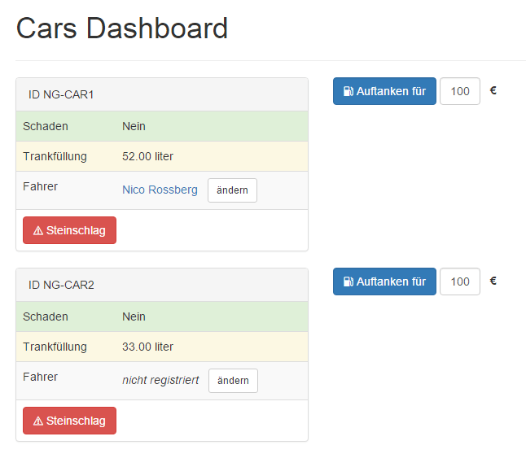
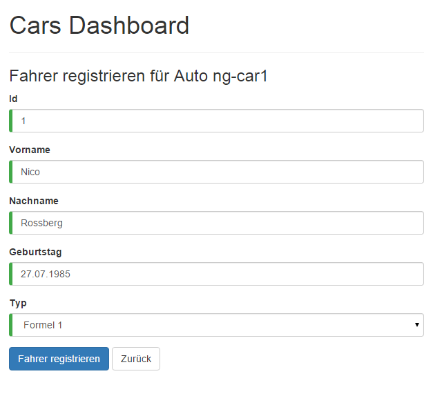
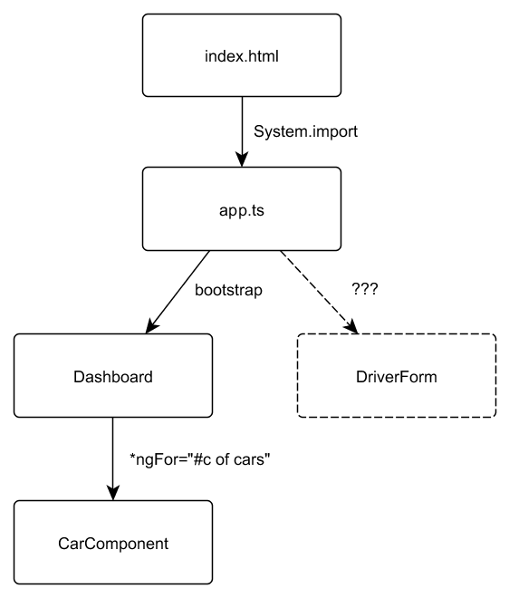
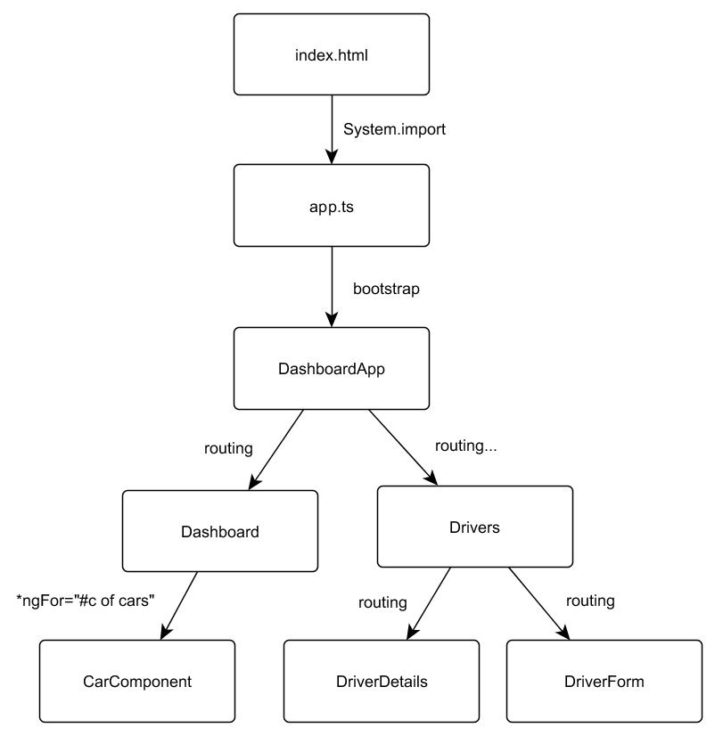

# Routing mit Angular 2.0

## Eine Single-Page Anwendung ist erst dann richtig vollständig, wenn man zwischen verschiedenen Ansichten hin- und her navigieren kann. Der Nutzer profitiert dabei von Seitenwechseln ohne merkbaren Ladevorgang. Das Routing wurde in Angular 2 intensiv ausgebaut und deckt nun auch fortgeschrittene Anwendungsfälle ab.

Dies ist der fünfte und letzte Artikel aus unserer Reihe zu Angular 2. In den vorherigen Artikeln haben wir bereits SystemJS, Templates, Dependency Injection, Unit-Testing, HTTP-Kommunikation und die Verarbeitung von Formulardaten kennengelernt. Mit dabei ist stets das "Car Dashboard", welches kontinuierlich um neue Funktionen erweitert wird. In diesem Artikel wollen wir alle Bereiche der Anwendung über die neue Routing-Engine miteinander kombinieren.



> 1. Komponente: Das Cars Dashboard ("Dashboard")


> 2 . Komponente: Formular zum Eintragen der Fahrerdaten ("DriverForm")

Wie gewohnt steht ein komplettes, lauffähiges Beispiel auf GitHub zur Verfügung. Sie finden alle besprochenen Inhalte unter: __https://github.com/Angular2Buch/angular2-routing__

## Komponenten

Zugegeben, in der letzten Ausgabe mussten wir ein wenig schummeln. Wir haben neben der Komponente "Dashboard" eine zweite Komponente namens "DriverForm" vorgestellt und anhand dieser die Formularverarbeitung erläutert. Das Problem war: Beide Komponenten waren jeweils einzeln in die Website eingebunden (_Listing 1_).

```html
<!-- index.html -->
<dashboard>loading...</dashboard>

            oder

<driver-form>loading...</driver-form>

// app.ts
bootstrap(Dashboard);

            oder

bootstrap(DriverForm);

// dashboard.ts
@Component({selector: 'dashboard'})
@View({templateUrl: 'app/dashboard.html'})
export class Dashboard { }

// driver-form.ts
@Component({selector: 'driver-form'})
@View({templateUrl: 'app/components/driver-form/driver-form.html'})
export class DriverForm { }
```
> Listing 1: Pseudo-Code zum Einbinden der Root-Component in die Website

Die hierarchische Anordnung der Komponenten aus der letzten Ausgabe sehen wir in _Bild 1_.


> Bild 1: Ohne Routing kommt man hier nicht weiter

Nun wollen wir natürlich auch in der Lage sein, beide Ansichten gleichzeitig zu verwenden, damit wir durch die Anwendung navigieren können. Hier kommt das Prinzip des __Routings__ ins Spiel. Als Routing bezeichnen wir das Laden von Bereichen der Anwendung abhängig vom Zustand. Im  Prinzip geschieht dasselbe, was wir auch manuell gemacht haben: Komponenten werden ausgetauscht. Der Dienst, der den Zustand der Angular-Anwendung verwaltet, nennt sich __Router__. Mittels Routing wollen wir nun Dashboard, Registrierungs-Formular und eine Detailansicht erreichbar machen. Alle Ansichten sollen vom Nutzer über verschiedene URLs aufrufbar sein.


## Routing

Das Prinzip der Single-Page-Applikation sieht eine einzige HTML-Seite vor, deren tatsächliche Inhalte asynchron nachgeladen werden. Dabei findet in der Regel kein "hartes" Neuladen der Seite statt. Die HTML5 History API, die in allen modernen Browsern implementiert ist, liefert die technische Grundlage, um das Routing adäquat anzugehen. Für ältere Browser existieren Fallbacks, wie z.B. die Verwendung von URLs mit einem #Hash (`HashLocationStrategy`). Der in Angular 2 standardmäßig vorhandene Router nennt sich "Component Router". Er kann mit verschiedenen Strategien verwendet werden, welche bestimmen, wie der Router seinen Zustand persistiert. Standardmäßig wird die HTML5 History API (`PathLocationStrategy`) verwendet. Es werden hierbei zur Identifikation der einzelnen Zustände gut lesbare URLs generiert.

Vorausgesetzt, es ist bereits eine Grundstruktur der Anwendung mit mehreren Komponenten vorhanden, sind drei Schritte nötig, um den Router zu verwenden:

1. __Routen konfigurieren:__ Wir weisen einem URL-Pfad eine zu ladende Komponente zu
2. __Komponenten anzeigen:__ Wir binden die geladene Komponente in das Template ein
3. __Routing booten:__ Wir aktivieren das Routing global in unserer Anwendung


## 1. Routen konfigurieren

Routen-Konfigurationen werden in Angular mithilfe des Decorators `RouteConfig` aus dem Modul `angular2/router` vorgenommen. Anders als noch in AngularJS 1 muss die Routenkonfiguration nicht mehr zentral für die gesamte Anwendung definiert werden. Verzweigungen können am "Ort des Geschehens", also bei der jeweiligen Komponente bestimmt werden. Die erste Komponente, die beim Bootstrapping der Anwendung geladen wird, ist der Einstiegspunkt des Routers. Sie wird __Root-Komponente__ genannt.

Dem Decorator `RouteConfig` wird also eine Liste von Routen übergeben, die für die Anwendung registriert werden sollen. Eine solche Route ist folgendermaßen aufgebaut:
```javascript
{ path: '/path', name: 'MyRoute', component: MyComponent }
```

* __path__: URL-Pfad für diese Route
* __name__: Name der Route (in CamelCase).
* __component__: Komponente, die durch die Route geladen werden soll. (z.B. `Dashboard` oder `DriverForm`)

Der Routen-Name ist ein Bezeichner, den wir später verwenden, um die Route zu identifizieren. Es spricht nichts dagegen, die Namen der Komponente (als String) zu verwenden. Verwendet man eine Komponente im Routing mehrmals, muss man sich einen Namen ausdenken - denn er muss eindeutig sein.

Wir erzeugen also eine neue Komponente, die wir `DashboardApp` nennen (siehe _Listing 2_).

```javascript
@RouteConfig([
    { path: '/dashboard', as: 'Dashboard', component: Dashboard, useAsDefault: true },
    { path: '/drivers/...', as: 'Drivers', component: Drivers }
])
@Component({
  selector: 'dashboard-app',
  templateUrl: 'app/dashboard-app.html',
  directives: [ROUTER_DIRECTIVES]
})
export class DashboardApp { }
```
> Listing 2: Neue Komponente DashboardApp mit Routing-Konfiguration

Mit dem Schlüssel `useAsDefault` können wir eine Standardroute festlegen, die geladen wird, falls keine Route vom Nutzer aufgerufen wird.

Wenn wir das _Listing 2_ betrachten, so fällt auf, dass für die Komponente `DriverForm` gar keine Route definiert wurde. Stattdessen sieht man eine Notation mit drei Punkten (`...`). Der Component-Router von Angular 2 geht Hand in Hand mit dem Konzept der Komponenten und ermöglicht die Vererbung von Routen. Das bedeutet, dass eine durch das Routing geladene Komponente weitere Routen-Konfigurationen besitzen kann, usw. Die Komponenten lassen sich beliebig tief verschachteln. So bleibt alles übersichtlich: Eine Komponente ist jeweils für die Verwaltung ihrer eigenen Routen zuständig und gibt die Verantwortlichkeit für Kind-Routen an die Kind-Komponente ab (_Listing 3_). Damit bleibt unsere Anwendung modular und die Komponenten haben definierte Schnittstellen, um mit anderen Teilen der Anwendung zu kommunizieren.

```javascript
@Component({})
@View({
  /* [...] */
})
@RouteConfig([
  { path: '/details/:forCarId', as: 'Details', component: DriverDetails },
  { path: '/create/:forCarId',  as: 'Create', component: DriverForm }
])
export class Drivers {}
```
> Listing 3: Kind-Komponente `Drivers` definiert Unter-Routen

Um das Beispiel noch ein wenig zu komplettieren, haben wir eine weitere Komponente eingebunden. Sie soll die Details zu einem Fahrer anzeigen (`DriverDetails`). Die neue Hierarchie der Komponenten sehen wir in _Bild 2_.


> Bild 2: Mittels Routing sind nun alle Komponenten erreichbar

## 2. Komponenten anzeigen

Nun sind die Routen und deren Pfade konfiguriert, doch es ist noch nicht klar, wo die jeweiligen Komponenten im Template angezeigt werden sollen. Für diesen Zweck wird die Direktive `RouterOutlet` aus dem Modul `angular2/router` verwendet. An der Stelle, wo diese Direktive ins Template eingebunden wird, soll der Router die jeweils aktuelle Komponente dynamisch austauschen.

Die Komponente `DashboardApp` hat damit folgendes Template:
```html
<!-- dashboard-app.html -->
<h1>Cars Dashboard</h1>
<hr>
<router-outlet></router-outlet>
```

Die Überschrift bleibt dadurch permanent in der Anwendung sichtbar. Darunter wird dann die jeweils angeforderte Komponente eingefügt. Die Kind-Komponente `Drivers` ist nur für die "Verteilung" der Routing-Anfragen auf die URL `/drivers/...` zuständig. Sie benötigt auch die Direktive `RouterOutlet` im Template, um die geroutete Komponente anzuzeigen. Mehr Aufgaben erfüllt `Drivers` aber nicht, deshalb fällt das Template denkbar kurz aus. Es bietet sich an, alles direkt im Quelltext der Komponente zu konfigurieren:

```javascript
@Component({})
@View({
  directives: [ROUTER_DIRECTIVES],
  template: '<router-outlet></router-outlet>'
})
@RouteConfig( /* [...] */ )
export class Drivers {}
```


## 3. Routing booten

Damit wären schon fast alle Änderungen durchgeführt. Nun muss das Routing nur noch aktiviert werden. Dazu verwenden wir die `ROUTER_PROVIDERS`. Diese Abhängigkeiten werden der `bootstrap`-Methode übergeben, mit der auch die Start-Komponente unserer Anwendung geladen wird.
Sie konfiguriert den __IoC-Container__ von Angular. Die Mechanismen hinter "Inversion of Control (IoC)" und "Dependendy Injection (DI)" haben wir in Ausgabe 02/2016 kennengelernt.

```javascript
// app.ts
import {bootstrap} from 'angular2/platform/browser';
import {ROUTER_PROVIDERS} from 'angular2/router';

bootstrap(DashboardApp, [ROUTER_PROVIDERS]);
```


## Routen verlinken

Benutzbar wird das Routing natürlich erst mit klickbaren Links innerhalb der Anwendung. Wichtig ist hierbei, dass Verlinkungen zwischen den Zuständen nicht manuell gesetzt, sondern automatisch erstellt werden! Das hat den Vorteil, dass die tatsächliche URL nicht vom Entwickler fest einprogrammiert werden muss. Außerdem wird so sichergestellt, dass die aktuelle Strategie verwendet wird. Bei der Verwendung der HTML5 History API wird z.B. nicht wirklich eine neue Seite aufgerufen, sondern lediglich der Browser-Verlauf manipuliert.

Wir verwenden die Direktive `RouterLink` aus dem Modul `angular2/router`. In der Direktive geben wir an, welche Route verlinkt werden soll. Die Notation erfolgt als Liste: das sogenannte __Link-Parameter-Array__.

```html
<a [routerLink]="['/Dashboard']">zum Dashboard</a>
```

Im ersten Element des Arrays geben wir die zu ladende Route an. Wir müssen hier den Namen verwenden, den wir bei der Routen-Konfiguration in der Komponente festgelegt haben. Wichtig ist, dass ein Link immer relativ zur aktuellen Komponente ist! Das gilt es zu berücksichtigen, wenn wir mehrere Komponenten verschachteln und die Routen vererben. Das Array hat im vorherigen Beispiel nur ein Element. Es kann aber beliebig viele Elemente besitzen, die jeweils auf weitere Kind-Routen verweisen.

Möchten wir mit einer Route weitere Werte übergeben, so verwenden wir als letztes Element im Array ein Objekt mit Routen-Parametern. Zur Komponente `DriverDetails` wechselt man zum Beispiel mit folgendem Link. Es wird die ID des Fahrzeugs übergeben, sodass die Komponente die Details des gewählten Fahrers abrufen kann:

```html
<a [routerLink]="['/Drivers', 'Details', { forCarId: car.id }]">Fahrer anzeigen</a>
```

Klicken wir auf den generierten Link, so wird die Adresszeile auf `http://example.org/drivers/details/ng-car1` aktualisiert. Dank der HTML5 History API verursacht der Wechsel kein echtes Neuladen der Seite.

Es kann aber jederzeit vorkommen, dass die sichtbare Adresse per Reload oder per Bookmark aufgerufen wird. Dieser Fall wird von Angular ohne Probleme berücksichtigt. Es muss aber sichergestellt werden, dass auch der Webserver bereit für eine Single-Page-Anwendung ist. Bei einer Route handelt es sich nicht um einen echten Verzeichnispfad auf dem Server. Bei einer unbekannten Adresse wie z.B. `drivers/create/ng-car1` darf der Server allerdings nicht mit einem Fehler 404 antworten. Er muss so konfiguriert werden, dass für jeden Aufruf stets die `index.html` ausgeliefert wird.
Dieses Verhalten kann im Apache mit dem Modul `mod_rewrite` erreicht werden. Dabei gilt zu beachten, dass nur Routen-Aufrufe auf die HTML-Seite verwiesen werden dürfen, nicht aber die Anwendung und statische Elemente (Bilder, etc.).

In der `index.html` biegt folgende Angabe alle relativen Pfade wieder zurecht:

```html
<!-- index.html -->
<base href="/">
```


## Routen-Parameter empfangen

Wenn man mittels Routen-Parametern Werte an die Komponente übergibt, so muss man diese natürlich auch empfangen können. Dazu dient die Klasse `RouteParams`, die wir in den Konstruktor injizieren und damit in der Komponente bekanntmachen können. Die Instanz von `RouteParams` ist stets mit den jeweiligen Parametern der Route befüllt. Über die Methode `RouteParams.get()` können wir nun einen Parameter abrufen. Als Argument übergeben wir den Bezeichner, den wir bei der Definition des Links festgelegt haben (_Listing 4_).

```javascript
import {RouteParams} from 'angular2/router';

@Component({ /* [...] */ })
export class DriverDetails {
  constructor(params: RouteParams) {

    var id = params.get('forCarId');
    console.log("Fahrer für Auto", id);
  }
}
```
> Listing 4: RouteParams enthält alle Routen-Parameter


## Fazit und Ausblick

Die wichtigsten Bestandteile des Routings haben wir hiermit kennengelernt. Unsere Anwendung "Cars Dashboard" ist nun voll funktionsfähig. Ganz selbstverständlich haben wir dabei ein `RouterOutlet` im `RouterOutlet` verwendet. Solche verschachtelten Views waren in AngularJS 1 noch nicht mit Boardmitteln realisierbar. Die Verwendung des AngularUI-Routers war daher die de-facto Lösung für komplexere Szenarien. Der neue Router in Angular 2 ist zwar weiterhin nicht ganz so mächtig, deckt aber viel mehr Anwendungsfälle ab. Dies ist eine gute Entwicklung des Frameworks. Die Balance zwischen einer einfachen Verwendung und vielen Funktionen bleibt unserer Ansicht nach gut gewahrt.

Mit diesem Artikel wollen wir unsere Reihe zum neuen Framework von Google abschließen. Mittels der vorgestellten Themen über fünf Ausgaben der __Web und Mobile Developer__ lässt sich bereits ein Most-Valuable-Product erstellen. Die Github-Repositories haben wir alle auf den neuesten Stand (zum Redaktionsschluss: Angular Beta.2) gebracht. Viele weitere Aspekte von Angular 2 gilt es zu erforschen. Wir – das sind Johannes Hoppe, Danny Koppenhagen, Ferdinand Malcher und Gregor Woiwode – laden Sie gern zu einer längeren Entdeckungsreise ein. Mit Erscheinungsdatum der finalen Version von Angular 2 werden wir ein deutschsprachiges Buch zum Framework veröffentlichen.

<hr>

## Alle Angular 2-Artikel im Überblick

* Teil 1 – Modularer Code mit SystemJS und jspm  
Web und Mobile Developer Ausgabe 12/2015  
Codebeispiele: https://github.com/Angular2Buch/angular2-module  

* Teil 2 – Templatesyntax und Web Components  
Web und Mobile Developer Ausgabe 01/2016  
Codebeispiele: https://github.com/Angular2Buch/angular2-template-syntax  

* Teil 3 – Dependency Injection und Unit-Testing  
Web und Mobile Developer Ausgabe 02/2016  
Codebeispiele: https://github.com/Angular2Buch/angular2-testing  

* Teil 4 – Formularverarbeitung und Validierung  
Web und Mobile Developer Ausgabe 03/2016  
Codebeispiele: https://github.com/Angular2Buch/angular2-forms  

* Teil 5 – Routing  
aktuelle Ausgabe 04/2016  
Codebeispiele: https://github.com/Angular2Buch/angular2-routing  

<hr>

## Über die Autoren


**Johannes Hoppe** ist selbstständiger IT-Berater und Softwareentwickler. Er arbeitet derzeit als Architekt für ein Portal auf Basis von .NET und AngularJS. Er veranstaltet Trainings zu AngularJS und bloggt unter http://blog.johanneshoppe.de/ .


**Ferdinand Malcher** ist selbständiger Softwareentwickler und Mediengestalter aus Leipzig. Seine Schwerpunkte liegen auf Webanwendungen mit Angular und Node.js.


## Links zum Thema
* https://github.com/angular/angular/ - Offizielles Angular 2 Repository
* https://github.com/angular/angular-cli - Das neue Kommandozeilentool für Angular
* https://angular.io/docs/ts/latest/guide/router.html - Dokumentation von Angular zu Routing und Navigation
