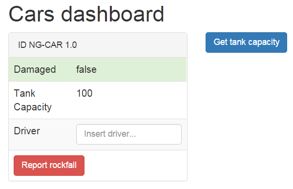

# Angular Template-Syntax

## Das Templating mit AngularJS war bereits ein mächtiges Werkzeug. Mit Angular 2.0 legen die Entwickler nun kräftig nach.

> **Hinweis** Das hier gezeigt Beispiel nutzt eine Vorschauversion von Angular 2.0. Der hier gezeigte Code muss für spätere Versionen gegebenen Falls angepasst werden.

## Einleitung

Im vorangegangenen Artikel sind wir detailliert auf die Modularisierung eingegangen, die mit Angular 2.0 einhergehen wird. Es wurde erläutert, wie mit `SystemJS` Bibliotheken und eigen Client-Side-Skripte geladen und ausgeführt werden. Selbst die Ausführung von ECMAScript 6 Modulen ist nun keine Hürde mehr. Wir können nun tiefer in das Framework eintauchen.
Dieser Artikel stellt die neue Template-Syntax von Angular 2.0 vor. Es halten zahlreiche, neue Möglichkeiten Einzug, um Oberflächen zu beschreiben. Die Entwickler von Angular verfolgen hierbei ein großes Ziel: Das Konzept der Template-Syntax eindeutiger und nachvollziehbarer zu formulieren, als es bei der Vorgängerversion der Fall ist. Auch der Support durch IDEs, wie zum Beispiel bessere Auto-Completion, soll dadurch verbessert werden und die Produktivität des Entwicklers steigern.

Im folgenden werden anhand eines Beispiels die neuen Bestandteile der in Angular 2.0 verwendeten Syntax erläutert. Wir nehmen an, dass in einem Prototypen für ein künftiges Dashboard Schäden an Autos registriert und angezeigt werden.



Neben einer ID und dem Schadensstatus kann auch der aktuelle Füllstand des Fahrzeugs abgefragt werden. Des weiteren kann mit einem Klick ein Steinschalg (engl: "rockfall") gemeldet werden.

> **Übrigens** Sie finden das hier vorgestellten Beispiel auf GitHub unter: https://github.com/Angular2Buch/template-syntax

## Components & Views

Angular 2 Anwendungen bestehen aus verschiedenen Komponenten (Components), die miteinander agieren können.

Für das Dashboard wird also eine Komponente benötigt. Im Dashboard wird eine Liste von Autos abgebildet werden. Das bedeutet, dass wir hierfür ebenfalls eine Komponente implementieren werden.

Eine Angular 2.0 Kompoenente ist wie folgt aufgebaut

```javascript
// dashboard.component.ts
import { Component, View } from 'angular2/angular2';

@Component({ selector: 'dashboard' })
@View({
    template: `<p>{{ id }}</p>`
})
export default class DashboardComponent {
    id: string = 'NG-Car 2015';
}
```

Von Angular importieren wir zunächst zwei Module `@Component()` und `@View()`. Sie
werden als Annotationen bezeichnet. Annotationen ermöglichen es Klassen zu
erweitern. Hier deklarieren wir über @Component(), dass die Dashboard-Komponente über den `selector` &lt;dashboard&gt; im HTML eingesetzt wid.
In @View() definieren wir das Template, das mit der Komponenten verknüpft ist. In diesem Beispiel wird das Feld `id`, aus der Klasse `DashboardComponent`, im Template gebunden und angezeigt. And dieser Stelle bekommt man ein Gefühl, was eine Kompoenente ist.

> Eine Komponente ist ein angereichertes Template, das im Browser zur Anzeige gebracht wird. Das Template verfügt über ein spezifisches Verhalten, das in Angular 2.0 durch Typescript beschrieben wird.

Um in dem Dashboard nun ein Auto abbilden zu können wird eine weitere Komponente benötigt.

```javascript
// car.component.ts
import { Component, View, Input } from 'angular2/angular2';

@Component({ selector: 'car' })
@View({
    template: `<p>{{ id }}</p>`
})
export default class CarComponent {
    @Input() id: string;
}
```

Im ersten Schritt soll diese Komponente lediglich die zugewiesene Identifikationsnummer ausgeben.
Die @Input() Annotation bietet uns hierbei die Möglichkeit Werte an die `CarComponent` zu übergeben. Näheres wird im folgenden Abschnitt erläutert.

Nun können wir die CarComponent in unserem Dashboard refrenzieren und im Template verwenden.

```javascript
// dashboard.component.ts
import { Component, View } from 'angular2/angular2';
import { CarComponent } from '../car/car.component';

@Component({ selector: 'dashboard' })
@View({
    directives: [CarCompoent],
    template: `<car [id]="id"></car>`
})
export default class DashboardComponent {
    id: string = 'NG-Car 2015';
}
```

Im wesentlichen haben wir drei Anpassungen vorgenommen.
1. Über ein weiteres import statement laden wir die  `CarComponent`
2. @View() wird durch die Eigenschaft `directives` ergänzt, damit wir `CarCompoennt` im Template verwenden können.
3. Wir binden (genannt Property-Binding) das Feld `id` and die gleichnamige Eigenschaft der `CarComponent`

Wir haben eine erste Interaktion zwischen zwei Komponenten realisiert.

## Input- und Output-Properties

Input- und Output-Properties sind Eigenschaften die die API einer Angular-Komponente beschreiben. Über Inputs der Komponente übergeben. Mit Outputs kommuniziert die Komponente Änderungen nach außen.
Inputs werden durch `Property-Bindings` beschrieben. Outputs können über `Event-Bindings` abonniert werden

### Property-Bindings

Mit Properties werden einer Komponente Daten übermittelt.

```html
<car [id]="token"></car>
```

```javascript
@Component({
  selector: 'Car'
})
class Car() {
  @Input() id:string;
}
```

Anstatt eckiger Klammern, können Property-Bindings mit `bind-{property-name}="{value}"` werden.

```html
<car bind-id="token"></car>
```

### Event-Bindings

Events bieten die Möglichkeit auf Veränderungen einer Komponente zu reagieren.

```html
<car (damaged)="report(damage, $event)"></car>
```

```javascript
@Component({
  selector: 'damage-dashboard'
})
class Dashboard() {
  Car:Car;
}
```

Bei der Verwendung von Event-Bindings kann das Event-Objekt `$event` verwendet werden, um detaillierte Informationen über das ausgelöste Ereignis zu erhalten.

```javascript
@Component({ /* ... */ })
class Dashboard() {
  /* ... */

  report(damage, $event) {
    console.log($event.type) // click, hover, change, ...
  }
}
```

Neben der Verwendung runder Klammern, können Event-Bindings auch mit dem Ausdruck `on-{Event-Name}="{callback()}"`.

```html
<car on-damaged="report(damage)"></car>
```

## Interpolation

Bereits in AngularJS 1.x konnten Daten mithilfe zweier geschweifter Klammern an das HTML Template gebunden werden. Der Wert wurde mittels Interpolation ausgewertet und angezeigt.
Dieses Konzept bleibt in Angulars neuer Version erhalten.

```html
<p>{{ name }}</p>
```

Diese Schreibweise ist eine Vereinfachung. Bevor dieses Template im Browser ausgegeben wird es durch Angular folgender Maßen verarbeitet.

```html
<p [text-content]="interpolate(['Gregor'], [name])"></p>
```

Die Bracket-Syntax wird ebenfalls in ein Property-Binding übersetzt. Das erspart uns Entwicklern einige Tipparbeit. [[6]]

### Two-Way Bindings mit `ng-model`

## Lokale Variablen

Innerhalb eines Templates können Referenzen auf HTML-Elemente, Komponenten und Datenbindungen erzeugt werden, um mit ihnen zu arbeiten.

```html
<input #id type="text"/>
{{ id.value }}
```

Anstatt der # können lokale Variablen auch mit dem Prefix `var-` deklariert werden.

```html
<input var-id type="text"/>
{{ id }}
```

```html
<car #car></car>
<button (click)="car.getTankCapicity()">Get tank capacity</button>
```

```html
<car *ng-for="#c in cars" [model]="c">
```

> Bei dem * vor der ng-for Direktive handelt es sich um eine Kurzschreibweise. Näheres erfahren Sie im nächsten Abschnitt.

## * und &lt;template&gt;

Direktiven wie `ng-for`,`ng-if` und `ng-switch` werden zusammen mit einem `*`
verwendet. Diese Direktiven werden strukturelle Direktiven (Structural Directives) genannt, da sie DOM-Elemente hinzufügen oder entfernen.

```html
<div *ng-if="totalDamages > 0">{{ totalDamages }}</div>
```

In diesem Beispiel wird das &lt;div&gt; Element nur in den DOM-Tree gezeichnet,
wenn die Bedingung von `ng-if` wahr ist.
Bei dem `*` handelt es sich, um eine Kurzschreibweise, die das Schreiben des Templates vereinfachen soll.
Diese Schreibweise wird als _Micro Syntax_ bezeichnet, da Angular 2.0 diesen Ausdruck interpretiert und wieder in die uns bekannten Bindings umsetzt.
Beispielsweise ist auch folgende Verwendung der ng-if Direktive zulässig.

```html
<template [ng-if]="totalDamages > 0">
  <div>{{ totalDamages }}</div>
</template>
```

Angular übersetzt die Mikro Syntax in ein Property-Binding und umschließt das Template mit einem &lt;template&gt;-Tag. [[5]]

## Der Pipe-Operator `|`

Pipes korrespondieren zu den `filters` in AngularJS 1.x und  werden genutzt, um Daten zu für die Anzeige zu transformieren. Sie nehmen Eingabeargumente entgegen und liefern das transformierte Ergebnis zurück.
In einem Binding-Expression werden sie durch das Symbol `|` (Pipe) eingeleitet.

```html
/* Der Wert von name wird in Großbuchstaben ausgegeben */
<p>{{ name | uppercase}}</p>
```

Pipes können auch aneinander gehangen werden, um mehrere Transformationen durchzuführen.

```html
<p>{{ name | uppercase | lowercase}}</p>
```

## Der Elvis-Operator `?`

Die Bezeichnung "Elvis Operator" ist eine Ode an den populären Mythos, ob Elvis tatsächlich tot ist oder nicht.

Er ist ein nützliches Instrument, um zu prüfen, ob ein Wert `null` ist oder nicht. So können Fehlermeldungen bei der Template-Erzeugung vermieden werden.

## Was hat das mit HTML zu tun?

Auch wenn sich die Syntax zu Beginn ungewohnt ist, handelt es sich hierbei um valides HTML. [[6], [8]] In der HTML Spezifikation des W3C heist es:

> Attribute names must consist of one or more characters other than the space characters, U+0000 NULL, """, "'", ">", "/", "=", the control characters, and any characters that are not defined by Unicode.

# Kurz

- Input- und Output-Properties beschreiben die API einer Komponente
- Über Inputs "fließen" Daten in die Komponente hinein.
- Inputs werden über Property-Bindings aktualisiert ([property])
- Über Outputs "fließen" Daten aus der Komponente heraus.
- Outputs werden mithilfe von Event-Bindings abonniert ((event)).
- Ein Property-Binding und Event-Binding können kombiniert werden, um ein Two-Way-Binding zu beschreiben ([(twoWay)]). [[2]]

# Fazit

In Angular 2.0 wird die Template-Syntax in mehrere Konzepte aufgebrochen. Der Datenfluss zwischen Komponenten wird dadurch konkret definiert. Daher ist es mit einem Blick auf ein Template möglich, zu erkennen, wie sich eine Komponente verhält. Somit können, im Gegensatz zur Vorgängerversion AngularJS, Templates in Angular 2.0 diffiziler und genauer beschrieben werden.
Allerdings sind auch mehrere Möglichkeiten vorhanden Templates und Bindings zu definieren. Daher ist es ratsam, sich im Team auf jeweils eine der angebotenen Schreibweisen zu einigen, um ein vertrautes und homogenes Bild im Markup zu schaffen.

# Ausblick

Im nächsten Artikel wenden wir uns der Dependency Injection und dem Unit-Testing mit Angular 2.0 zu. Denn wie AngularJS 1.x, können bei dessem ambitionierten Nachfolger Komponenten und Dienste über Angulars integrierten IoC-Container miteinander kombiniert werden und dennoch für sich isoliert getestet werden.
Wie das alles funktioniert schauen wir in der nächsten Ausgabe an.

<hr>

## Über die Autoren


**Johannes Hoppe** ist selbstständiger IT-Berater, Softwareentwickler und Trainer. Er arbeitet derzeit als Architekt für ein Portal auf Basis von .NET und AngularJS. Er bloggt unter http://blog.johanneshoppe.de/ .


**Gregor Woiwode** ist als Softwareentwickler im Bereich des Competitive Intelligence bzw. Enterprise Knowledge Managements für ein Softwareunternehmen in Leipzig tätig. Er veranstaltet Trainings AngularJS. Er bloggt unter http://www.woiwode.info/blog/ .

<hr>

# Quellen

[1]: https://angular.io/docs/ts/latest/quickstart.html "5 Min Quickstart"
[2]: http://victorsavkin.com/post/119943127151/angular-2-template-syntax "Angular 2 Template Syntax"
[3]: https://www.youtube.com/watch?v=-dMBcqwvYA0 "ng-conf 2015 Keynote 2"
[4]: ng-book "2 - The Complete Book on AngularJS 2 by Ari Lerner, Felipe Coury, Nate Murray, Carlos Taborda"
[5]: https://angular.io/docs/ts/latest/guide/template-syntax.html "angular.io - Template-Syntax"
[6]:  http://blog.thoughtram.io/angular/2015/08/11/angular-2-template-syntax-demystified-part-1.html "Template-Syntax demystified"
[7]: https://youtu.be/bVI5gGTEQ_U "Angular 2 Data Flow – Jeff Cross, Rob Wormald and Alex Rickabaugh"
[8]: http://www.w3.org/TR/html-markup/syntax.html "W3C - HTML: The Markup Language (an HTML language reference)"
