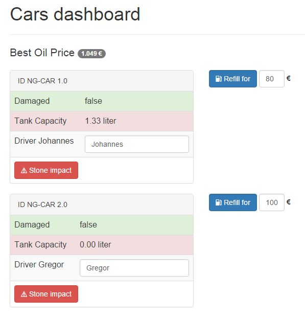

# Dependecy Injection und Unit-Testing mit Angular 2.0

## Dependecy Injection gute Testbarkeit waren schon immer ein Alleinstellungsmerkmal für AngularJS. Mit der neuen Version wurden viele Details verbessert.

> **Hinweis** Das hier gezeigte Beispiel nutzt eine Vorschauversion von Angular 2.0. Der gezeigte Code muss für spätere Versionen wahrscheinlich angepasst werden.

## Einleitung

In den beiden vorangegangenen Artikeln zu Angular 2.0 wurde zunächst ein modulares Setup auf Basis von SystemJS beschrieben. In der zweiten Ausgabe haben wir Ihnen anhand einer Beispielanwendung die neue Template-Syntax vorgestellt. Es wird Zeit, der Anwendung neue Funktionen zu geben, professionelle Entwurfsmuster anzuwenden und Fehlerfreiheit des Codes mit Unit-Tests zu beweisen!


## Inversion of Control

Das Dashboard war die Demo-Anwendung aus der letzten Ausgabe. Im Dashboard soll man nun Informationen zum aktuell günstigsten Benzinpreis erhalten. 


> Screenshot: Mit dem günstigsten Benzinpreis die Autos betanken

Wenn man an einer beliegen Stelle im Programmcode eine andere Funktionalität benötigt, dann liegt es zunächst nahe, jene andere Funktionalität an Ort und Stelle zu initialisieren. Ein erster Ansatz könnte wie folgt ausschauen:

```javascript
var Dashboard = function() {
  this.gasService = new GasService();
  
  // gasService verwenden
  this.gasService.getBestPrice();
}
```


Dieses Vorgehen ist prinzipiell einwandfrei - nur stößt man mit zunehmender Menge an Code an eine Grenze. Der Code wird zunehmend unübersichtlicher, schwerer zu Warten und verweigert sich einem einfachen Test-Setup. Das Problem lässt sich dadurch begegnen, dass man die Verantwortung zum Erzeugen von Abhängigkeiten an eine übergeordnete Stelle abgibt. 

Dies ist die Idee hinter dem Prinzip des **"Inversion of Control"**. Bei diesem Prinzip kehrt man die Verantwortlichkeit einfach um. Das Prinzip findet sich in verschiedenen Entwurfsmustern in allen Programmiersprachen wieder. AngularJS zum Beispiel verwendet das Entwurfsmuster **"Dependency Injection"**. Ein Framework im Kern von AngularJS sorgt dafür, das die benötigte Abhängigkeit identifiziert wird und der Konstruktor-Funktion beim Aufruf bereit gestellt wird. In AngularJS 1.x kann man einen Service wie folgt anfordern:

```javascript
// AngularJS 1.x 
var Dashboard = ['GasService', function(GasService) {
  this.gasService = GasService;
}]
```

Wer das DI-Framework aus AngularJs 1.x kennt, der wird mit Sicherheit auch an dessen Grenzen gestoßen sein. Besonders hinderlich sind fehlende Namespaces und die Notwendigkeit, stets alle Abhängigkeiten per Name zu identifizieren. Dies ist doppelter Schreibaufwand. Im vorliegenden Beispiel muss man zum Beispiel zwei mal "GasService" schreiben.

## Dependency Injection in Angular 2.0


> Die wichtigsten Bausteine für DI in Angular 2.0


 Mit der Unterstützung von ECMAScript 6 bzw. von TypeScript wird die Bedienung nun viel vertrauter. So lässt sich mittels des Decorators `@Inject` die Abhängigkeit in den Konstruktor injizieren:

```js
class GasService {
}

class Dashboard {
  constructor(@Inject(GasService) gasService) {
    console.log('Dependency:', gasService)
  }
}

var injector = Injector.resolveAndCreate([Dashboard, GasService]);
var dashboard = injector.get(Dashboard);
```
> Listing 1: Constructor Injection mit ES6

Die Methode `resolveAndCreate()` erzeugt einen einsatzbereiten Injector. Die Methode akzeptiert ein Array aus Typen oder Providern. Wird nur ein Typ übergeben, so wird ein entsprechende Provider für diesen Typ erzeugt. Sofern man TypeScript einsetzt, kann man die Schreibweise noch etwas mehr vereinfachen. Durch die Verwendung von Typen, kann man auf den Decorator `@Inject` verzichten:

```js
@Injectable()
class Dashboard {
  constructor(gasService: GasService) {
    console.log('Dependency:', gasService)
  }
}
```
> Listing 2: Constructor Injection mit TypeScript


Damit dieses Beispiel funktioniert, muss TypeScript einen Hinweis dazu erhalten, dass die Konstruktor mit Dekoratoren versehen werden soll. Dies geschieht mit dem Dekorator `@Injectable()`. Das erzeugte JavaScript aus Listing 1 und Listing 2 unterscheidet sich schlussendlich kaum voneinander. Auf die Verwendung von `@Injectable()` kann verzichtet werden, sobald ein anderer Decorator die Klasse verziert. Weitere Dekoratoren sind etwa `@Component()`, `@View` oder `@RouteConfig`. Da Angular 2.0 stark auf einen deklarativen Stil mittels Dekoratoren setzt, benötigt man `@Injectable()` eigentlich nur für eigene Service-Klassen.


## Durchstarten

Die Methode `resolveAndCreate()` kann man gut für ein schnelles Experiment oder in einem Unit-Test verwenden. Bei der Erstellung der eigentlichen Anwendung bedient man sich aber der bereits bekannten `boostrap` Methode. Zuvor haben wir bei dieser Methode nur den  ersten Parameter verwendet. Er gibt die Einsteigs-Komponente der Anwendung an - also die Dashboard-Komponente.

```js
// app.ts
import {bootstrap} from 'angular2/angular2';
import Dashboard from './components/dashboard/dashboard.component';

bootstrap(Dashboard);
```
> Listing X: Starten (bootstrapping) der Anwendung

Als zweiten Parameter akzeptiert die Methode wiederum ein Array aus Typen oder Providern. Sollte die Dashboard-Komponente oder eine andere Komponente den GasService benötigen, so lässt sich dieser wie folgt registrieren:

```js
// app.ts
import {bootstrap} from 'angular2/angular2';
import Dashboard from './components/dashboard/dashboard.component';
import GasService from './models/gasService';

bootstrap(Dashboard, [GasService]);
```
> Listing X: Bootrapping mit Registrierung der Dependency GasService


# Unit-Tests mit Karma

Unit-Tests verbessern die Qualität von Software. Tests beweisen, dass die Software das tut, wofür sie konzipiert wurde. Ebenso dokumentieren Tests fachliches Wissen und den Erkenntnisstand eines Entwicklers, den er zum Zeitpunkt der Erstellung hatte. Wenn man als Entwickler das existierende Wissen nicht durch Tests ausdrückt, ist die Wahrscheinlichkeit sehr hoch, dass das Wissen über die Zeit für einen selbst, für das Team und für das Unternehmen verloren geht. Die Verwendung von Angular erweist sich hierbei als großer Vorteil, da das Framework speziell darauf ausgerichtet ist, gut testbare Module zu erstellen.

Um Unit-Tests für JavaScript/TypeScript auszuführen, verwendet man am Besten einen so genannten Test-Runner. Prinzipiell würde auch nur ein Browser ausreichen. Doch dieses Setup lässt sich schlecht automatisieren. Empfehlenswert ist der Test-Runner "Karma", welcher zusammen mit AngularJS von Google entwickelt wurde. Das Tool basiert auf Node.js 
und läuft somit auf allen gängigen Betriebssystemen. Erwähnenswert ist die Tatsache, dass Karma einen eigenen Webserver startet und dann einen echten Browser (z.B. den Internet Explorer, Firefox und Chrome) die JavaScript-Dateien ausführen lässt. Der eigene Webserver vermeidet technische Probleme, die man bei der Ausführung per lokalem Dateisystem hätte. 

Die Installation von Karma sowie weiterer Plugins geschieht per NPM:
````
npm install karma karma-chrome-launcher karma-jasmine --save-dev
npm install karma-cli -g
```

Die Datei `package.json` wird dabei um neue "devDependencies" ergänzt. So kann man später per `npm install` das Setup jederzeit wieder herstellen. Die globale Installation des Karma command line interface (`karma-cli`) macht den Kommandozeilen-Befehl `karma` verfügbar. Mit `karma start` lassen sich nun die Unit-Tests starten. Beim Überprüfen der Datei `package.json` bietet es sich an, trotz der globalen Installation das Start-Script auf `karma start` festzulegen. So kann man später den Testrunner per `npm test` starten. Die Verwendung des "scripts"-Properties ist eine empfehlenswerte Konvention in der Node.js-Welt. Mit den Befehlen `npm install`, `npm start` und `npm test` sollte jeder Node.js-Entwickler vertraut sein.  

```
{
  [...]

  "devDependencies": {
    "karma": "^0.13.15",
    "karma-chrome-launcher": "^0.2.1",
    "karma-jasmine": "^0.3.6"
  },
  "scripts": {
    "start": "live-server",
    "test": "karma start"
  }
}
```
> Listing X: Auszug aus der `package.json`

Anschließend benötigt das Projekt eine Konfigurationsdatei, welche standardmäßig den Namen `karma.conf.js` trägt. Der Befehl `karma init` startet ein Kommandozeilen-Dialog, welcher bei der Erstellung der Datei hilft. Wie schon bei der Verwendung mit SystemJS/JSPM müssen anschließend noch paar Pfade gemappt werden (siehe 1. Artikel). An dieser Stelle ist das Setup zum aktuellen Stand (Alpha-46) noch recht holprig. Wir empfehlen Ihnen aktuell den ["ng2-test-seed"][1] von Julie Ralph. Julie ist eine sehr bekannte Google-Mitarbeiterin, welche auch die Hauptentwicklerin des Oberflächen-Testtools Protractor ist. Kopieren Sie sich aus diesem Github-Repository die beiden Dateien **`karma.conf.js`** und **`karma-test-shim.js`**. Die Codebeispiele zum Artikel enthalten ebenso die beiden Dateien.
 

# Unit-Tests mit Jasmine

Die Auswahl eines geeignete Test-Frameworks fällt aktuell sehr leicht. Derzeit wird nur Jasmine vollständig von Angular 2 unterstützt. Jasmine hat eine Syntax im Behavior Driven Development (BDD)-Stil. Die Funktion `describe()` definiert eine Gruppe  ("Suite") zusammenhängender Tests. Die Funktion erwartet zwei Parameter: Der erste Parameter ist ein String und beschreibt als Wort oder kurze Satz-Elypse was gerade getestet wird. Der zweite Parameter ist eine Funktion, die alle Spezifikationen ("Specs") beinhaltet. Die `it()` Funktion  beschreibt konkret eine Spezifikation. Auch eine Spezifikation benötigt beschreibende Worte. Describe-Methoden können beliebig tief verschachtelt werden, um die Übersichtlichkeit zu Erhöhen. Der BDD-Stil ermöglicht es, Tests in natürlicher Sprache zu definieren. Listing Nr. X veranschaulicht die Syntax.

```js
describe("A suite", () => {
  it("contains spec with an expectation", () => {
    expect(true).toBe(true);
  });
});
```
> Hello World mit Jasmine


<hr>

## Über die Autoren


**Johannes Hoppe** ist selbstständiger IT-Berater, Softwareentwickler und Trainer. Er arbeitet derzeit als Architekt für ein Portal auf Basis von .NET und AngularJS. Er bloggt unter http://blog.johanneshoppe.de/ .


**Gregor Woiwode** ist als Softwareentwickler im Bereich des Competitive Intelligence bzw. Enterprise Knowledge Managements für ein Softwareunternehmen in Leipzig tätig. Er veranstaltet Trainings AngularJS. Er bloggt unter http://www.woiwode.info/blog/ .

<hr>

[1]: https://github.com/juliemr/ng2-test-seed "5 Minuten Schnellstart"
